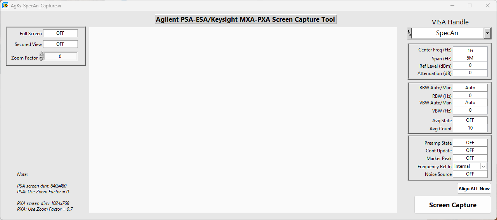

## 🌟 About The Project

AgKs_SpecAn_Screen_Capture is a simple screen capture tool for most Agilent PSA/ESA and Keysight MXA/PXA spectrum analyzers

---

## 🖼️ Screenshots / Front Panels

---

### ✨ Key Features

* **A stand-alone GUI or Inlined** Perfect for engineering development, troubleshooting, or integrating to existing LabVIEW test application.

* **Modular Design**  QMH framework for easy debugging and adding specific power supply feature, not already included.

---

### 💻 Software Requirements

* **LabVIEW Version:** `LabVIEW 2015 SP1 Windows 32-bit, or newer`

* **Required NI Toolkits & Modules:**
    * `None`

* **Required NI Drivers:**
    * `Agilent/Keysight N6700 LabVIEW driver (Project style)

* **Other Software Dependencies:**
    * `NI-VISA`
    * `NI-488.2`
	* `OpenG Toolkit/Library. Download & install via VI Package Manager`

### 🔩 Hardware Dependencies (Optional)

The listed instruments are the minimum required to be installed in <Labview install path><instr.lib> directory. These can be omitted from the project as needed.

* **Primary Hardware:**
  * `Windows 7/10/11 - 64-bit`

* **Instruments:**
    * `Agilent PSA/ESA spectrum analyzers`
	* `Keysight MXA/PXA spectrum analyzers`

* **Cabling:**
    * `GPIB Cable`
    * `Ethernet Cable`

---

## 🚀 Getting Started

Follow these steps to get the LabVIEW project up and running on your system.

### Prerequisites

Ensure you have the following installed and configured **before** opening the project:

1.  **LabVIEW Development Environment:** `LabVIEW 2015 SP1 Windows 32-bit, or newer` (as specified in [Software Requirements](#-software-requirements)).
2.  **All NI Toolkits & Modules:** As listed in [Software Requirements](#-software-requirements).
3.  **All NI Drivers:** As listed in [Software Requirements](#-software-requirements).
    * *Tip: Use NI MAX (Measurement & Automation Explorer) to verify driver installation and device communication.*
4.  **VI Package Manager (VIPM):** If the project uses VIPM packages, ensure VIPM is installed and configured. [Download VIPM](https://vipm.jki.net/download)
5.  **Required VIPM Packages:** Install all packages listed in [Software Requirements](#-software-requirements) using VIPM.
6.  **Git:** For cloning the repository. [Download Git](https://git-scm.com/)
7.  **(Optional) Connected Hardware:** If you intend to run with physical hardware, ensure it is connected and recognized in NI MAX as per [Hardware Dependencies](#-hardware-dependencies-optional).

### Installation & Opening the Project

1.  **Clone the repository:**
	* https://github.com/labviewprime/LabVIEW-Tools/AgKs_SpecAn_Screen_Capture
    * *Note on LabVIEW and Git:* Be mindful of LabVIEW's binary file format. Ensure your `.gitattributes` file is configured correctly to handle LV VIs, CTLs, etc., to minimize merge conflicts (often by marking them as binary or using `lvmerge` as a difftool/mergetool if set up).

2.  **Open the LabVIEW Project File:**
    * Navigate to the cloned directory.
    * Open the main LabVIEW Project file: `AgKs_SpecAn_Capture.lvproj`
    * Allow LabVIEW to load all dependencies. Resolve any missing VIs or conflicts if prompted (this ideally shouldn't happen if all prerequisites are met).

3.  **(Optional) Mass Compile:**
    * After opening the project, it's often a good idea to mass compile the project directory to ensure all VIs are compiled in the current LabVIEW version and to link any broken VIs.
    * In the LabVIEW Project Explorer, go to `Tools -> Advanced -> Mass Compile...` and select the project directory.

### Configuration

* **Configuration VI:** Edit the configuration text file (PS_Config.txt) to match your test station configuration requirement.
    * The configuration text file (PS_Config.txt) can be located anywhere in your local directories.
    * The KsPS_Control application generates and saves an INI to C:\Users\Public\Documents\[VI name]\{VI name].ini at exit.
	* The KsPS_Control application generates and saves an INI to C:\Users\Public\Documents\[VI name]\{VI name].ini when SAVE button is pressed.
* **Hardware Setup in NI MAX:** Ensure the N67xx parameters are correctly configured in NI MAX (Devices and Interfaces) and that their Aliases match those expected by the LabVIEW application (PS1, PS2, etc.)
	* If communicating over Ethernet, ensure the instrument handle URI or Alias are properly configured in NI MAX in Devices and Interfaces\Network Devices.
	* Use Windows terminal window (CMD or PowerShell) to PING to the Keysight N67xx power supply frame.

---

## 💡 Usage

### Running the Main Application/VI

1.  Open the `AgKs_SpecAn_Capture.lvproj` file.
2.  In the Project Explorer, locate and open the main application VI: `AgKs_SpecAn_Capture.vi` (or your specific main VI name).
3.  Ensure all hardware is connected and powered on (if applicable).
4.  Run the `AgKs_SpecAn_Capture.vi` by clicking the Run arrow (⇨) on the VI's toolbar.
5.  Interact with the Front Panel as designed.

### Using as a Library/SubVI

Not applicable

## 🔧 Key VIs and Libraries

* **`AgKs_SpecAn_Capture.lvproj`:** The main LabVIEW project file. Always open this to work with the project.
* **`AgKs_SpecAn_Capture.vi`:** The top-level VI that runs the main application.

## ⚙️ Build Specifications (Optional)

This project includes the following build specifications (accessible via the Project Explorer):

* **`KsN6701 PS Control`:** Builds a standalone executable for Windows.
    * Output Directory: `C:\Users\Public\Documents\LabVIEW\Builds`
    * To run: Execute `KsN6701 PS Control.exe` after building.

To build an executable or installer:
1.  Open `AgKs_SpecAn_Capture.lvproj`.
2.  Expand "Build Specifications" in the Project Explorer.
3.  To build an executable (EXE), right-click on the desired specification (e.g., `Executable Builder`) and select "Build".
4.  To build an application installer, right-click on the desired specification (e.g., `Installer`) and select "Build".
5.	Follow the prompts. The output will be in the specified output directory.

## 🧪 Testing (Optional)

Not Required

---

## 🤝 Contributing

Contributions are welcome! If you'd like to improve this LabVIEW project:

1.  Fork the Project.
2.  Create your Feature Branch (`git checkout -b feature/AmazingFeature`).
3.  Commit your Changes (`git commit -m 'Add some AmazingFeature'`).
    * *Remember to save VIs for the correct LabVIEW version specified in the project.*
    * *Document any new VIs or significant changes to block diagrams.*
4.  Push to the Branch (`git push origin feature/AmazingFeature`).
5.  Open a Pull Request.

Please read [CONTRIBUTING.md](LINK_TO_YOUR_CONTRIBUTING_FILE) (if available) for detailed guidelines. Pay attention to LabVIEW-specific best practices (e.g., code style, error handling, documentation).

---

## 📜 License

Distributed under the **MIT License**.
See `LICENSE.md` for more information.

## 🏆 Authors & Contributors

* **Aldrin Albano** - [@labviewprime](https://github.com/labviewprime)

## 📞 Contact & Support

**Aldrin Albano (labviewprime)**

* Email: labviewcoder@gmail.com (mailto:labviewcoder@gmail.com)
* Project GitHub Issues: https://github.com/labviewprime/KsPS_Control/Issues/issues (https://github.com/labviewprime/AgKs_SpecAn_Capture/Issues/issues)
